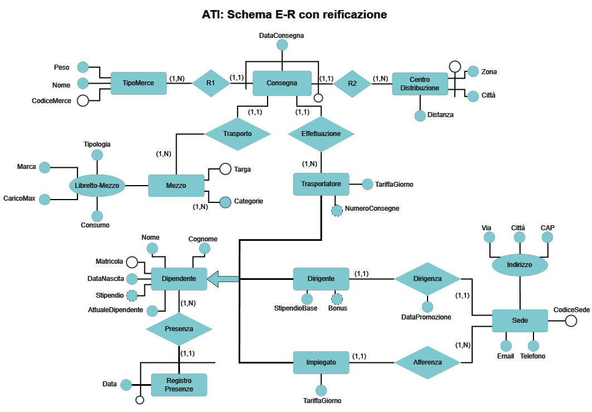

# BataBase Exam Project
This is a simple project for a University Database Exam. We were tasked with creating a functional MySQL Database with a Java-based user interface for a hypothetical client, along with all the necessary documentation.

- The database should include specific characteristics in the Entity-Relationship Schema, such as: multivalued attributes, derived attributes, three or more entities, reified entities, etc.
- The user interface should allow users to perform insertions, deletions, and alterations in at least one table.

We focused on a hypothetical transport company that needs to manage its vehicles and workers.

## E-R Diagram 

    

## Dependencies
- [LGoodDatePicker](https://github.com/LGoodDatePicker/LGoodDatePicker) 11.2.1 -  DatePicker for JSwing :  
    - import `LGoodDatePicker-11.2.1.jar` and  `LGoodDatePicker-11.2.1-javadoc.jar ` in project structure;
  
- JDBC Downladable [Here](https://www.jetbrains.com/datagrip/jdbc-drivers/) (for Intellij):
    - import `mysql-connector-java-8.0.25.jar` in project structure;

### No Warranties
Released 'As Is'. No Warranties.
